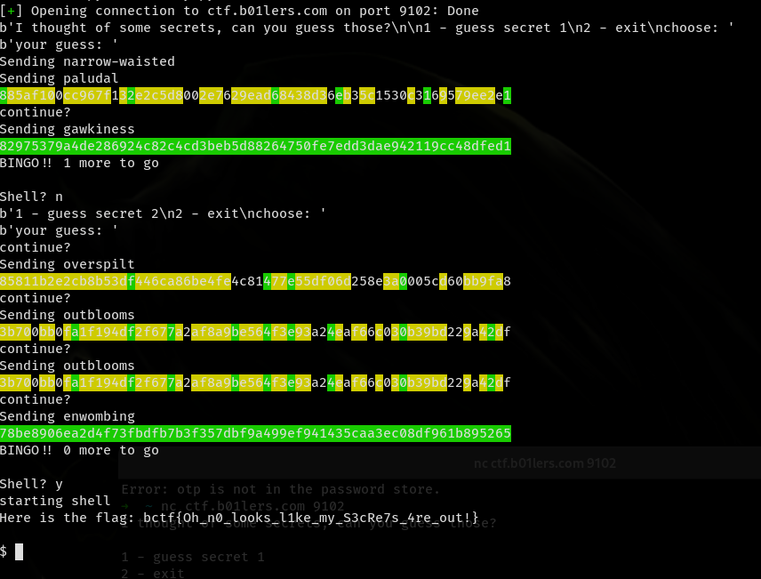

# SHArdle

This challenge was similar to something interesting I came across earlier this year, [passWORDLE](https://rsk0315.github.io/playground/passwordle.html).  
Of course, when I ran into that site, I just thought it was a neat joke and didn't think much of it.  


At first, I was shocked to see something like this as a challenge, since some serious brute-forcing would be required to solve it.  
After taking a closer look at the code though, I realized that the challenge was a _lot_ easier than what I was making it out to be once I realized what the `valid` function was actually doing.
```
if not valid(s):  print("INVALID GUESS")
```

At first, I assumed that it was checking for a certain amount of characters after doing some quick manual testing through `nc`. Once I started bruteforcing, I quickly realized that only dictionary words were valid. That makes things much easier!

I created a quick rainbow table with the default unix dictionary, read it into a word:hash python dictionary, and simply removed any entries that didn't match the green indexes of the hash digest.

Pretty fun challenge! It was good practice for working with byte strings in Python.


